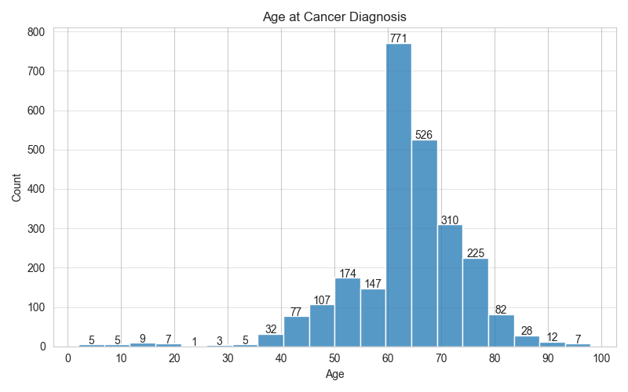

# Synthetic EHR Cancer Cohort Analysis

[](https://github.com/yifeikang/ehr-cancer-cohort-analysis/actions/workflows/main.yml)

Exploratory analysis of synthetic longitudinal electronic health record (EHR) data to identify, validate, and characterize patients with cancer using reproducible Python-based healthcare analytics workflows.

---

## Project Overview

This project analyzes the Synthea synthetic EHR dataset to:

- Explore longitudinal healthcare data structure
- Define and validate a reproducible cancer cohort
- Characterize patient demographics and healthcare utilization
- Demonstrate hybrid rule-based cancer phenotyping workflows
- Evaluate cohort validation strategies using multiple clinical domains
- Discuss limitations and real-world EMR cohort refinement approaches

Although the dataset is synthetic, the workflow was intentionally designed to reflect challenges commonly encountered in real-world longitudinal EMR systems.

---

## Objectives

1. Explore the structure and contents of the Synthea EHR dataset
2. Identify patients with cancer using both diagnosis text matching and structured SNOMED CT diagnosis codes
3. Analyze:
   - demographics
   - cancer subtype distributions
   - age at diagnosis
   - healthcare utilization
   - longitudinal follow-up
4. Demonstrate phenotype validation strategies using medications and procedures
5. Discuss methods for improving cohort specificity in real-world EMR systems

---

## Technologies Used

- Python
- pandas
- numpy
- matplotlib
- Jupyter Notebook

---

## Repository Structure

```text
ehr-cancer-cohort-analysis/
│
├── data/
│   ├── raw/
│   │   └── (source CSV files)
│   └── processed/
│       └── (derived tables and analysis outputs)
│
├── notebooks/
│   └── cancer_cohort_notebook.ipynb
│
├── figures/
│   ├── age_at_diagnosis.png
│   ├── cancer_type_distribution_by_gender.png
│   ├── encounter_distribution.png
│   ├── cohort_flow_overview.png
│   └── validation_summary.png
│
├── requirements.txt
├── .gitignore
└── README.md
```

---

## Dataset

Synthetic EHR data generated using Synthea.

Source:  
https://dataverse.harvard.edu/dataset.xhtml?persistentId=doi:10.7910/DVN/BWDKXS

Dataset used:

- `synthea-patient-pop1-csv.zip`

---

## Data Setup

1. Download the dataset from Harvard Dataverse
2. Extract the CSV files
3. Place the raw CSV files into `data/raw/`
4. Save derived tables, cleaned extracts, or intermediate outputs in `data/processed/`

Example:

```text
data/raw/
├── patients.csv
├── conditions.csv
├── encounters.csv
├── medications.csv
├── procedures.csv
└── observations.csv

data/processed/
└── cohort_flow_summary.csv
```

---

## Cohort Definition

Cancer patients were identified from the `CONDITIONS` table using a hybrid cohort extraction strategy combining both structured SNOMED CT diagnosis codes and diagnosis description keyword matching.

### Structured-Code Extraction

Code-based extraction used SNOMED CT diagnosis codes representing major malignant neoplasm categories, including:

- lung cancer
- breast cancer
- colorectal cancer
- prostate cancer
- hematologic malignancies
- metastatic neoplasms

Broad malignant neoplasm concepts were also included to improve cohort sensitivity.

### Diagnosis Text Matching

Keyword-based filtering of diagnosis descriptions included terms such as:

- cancer
- malignant
- carcinoma
- neoplasm
- leukemia
- lymphoma
- melanoma

Exclusion criteria were applied to reduce false positives, including:

- family history of cancer
- screening encounters
- benign neoplasms
- rule-out diagnoses

The final cancer cohort combined patients identified through both structured-code and text-based methods.

The first qualifying diagnosis date was used as the index cancer diagnosis date.

---

## Cohort Validation

To improve phenotype specificity, additional validation layers were applied using supporting clinical evidence from:

- oncology-related medications
- cancer-related procedures
- longitudinal encounter patterns

Procedure-based validation included terms associated with:

- biopsy
- mastectomy
- tumor resection
- radiation therapy
- oncology encounters

Patients were categorized into phenotype confidence groups based on the consistency of diagnosis, medication, and procedure evidence.

This multi-domain validation strategy was designed to simulate real-world EMR cohort refinement workflows.

---

## Analytical Workflow

1. Load and inspect EHR tables
2. Clean and standardize date variables
3. Identify cancer-related diagnoses
4. Create patient-level cancer cohort
5. Calculate age at diagnosis and follow-up
6. Generate descriptive statistics and visualizations
7. Evaluate healthcare utilization patterns
8. Apply cohort validation logic
9. Discuss limitations and cohort refinement strategies

---

## Key Analyses

### Demographics

- Age distribution
- Sex distribution
- Race and ethnicity distribution

### Cancer Cohort Characterization

- Cancer subtype frequency
- Age at diagnosis
- Longitudinal follow-up duration

### Healthcare Utilization

- Encounter frequency
- Procedures
- Medications
- Follow-up patterns

### Cohort Validation

- Medication-supported diagnoses
- Procedure-supported diagnoses
- Validation overlap analysis
- Phenotype confidence refinement

---

## Example Output

### Age at Cancer Diagnosis



---

## Limitations

This analysis uses synthetic EHR data and a rule-based cohort definition.

Potential limitations include:

- Rule-out diagnoses
- Incomplete disease confirmation
- Lack of pathology reports
- Simplified coding structure
- Absence of unstructured clinical notes
- Limited temporal clinical context

---

## Real-World EMR Refinement Strategies

In a production healthcare environment, cohort validation could be improved using:

- pathology reports
- oncology medications
- chemotherapy administration records
- tumor registry data
- ICD/SNOMED mappings
- temporal validation logic
- NLP on clinical notes
- imaging report interpretation
- manual chart review

---

## Future Improvements

Potential future extensions include:

- NLP-based phenotype extraction
- temporal sequence validation
- pathology integration
- survival analysis
- OMOP/FHIR standardization
- scalable Spark-based pipelines

---

## Reproducibility

This project was designed with reproducibility and transparency in mind:

- notebook-based workflow
- modular analysis structure
- documented cohort logic
- version-controlled code
- reusable Python functions
- fully executed notebook outputs

---

## Running the Analysis

Install required packages:

```bash
pip install -r requirements.txt
```

Launch Jupyter Notebook:

```bash
jupyter notebook
```

Open:

```text
notebooks/cancer_cohort_notebook.ipynb
```

---

## Author

Yifei Kang